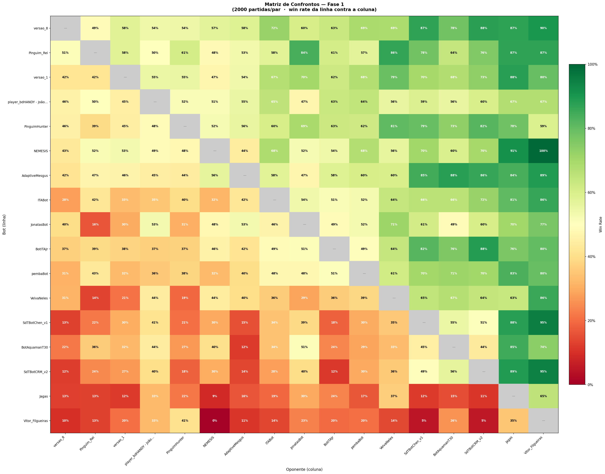
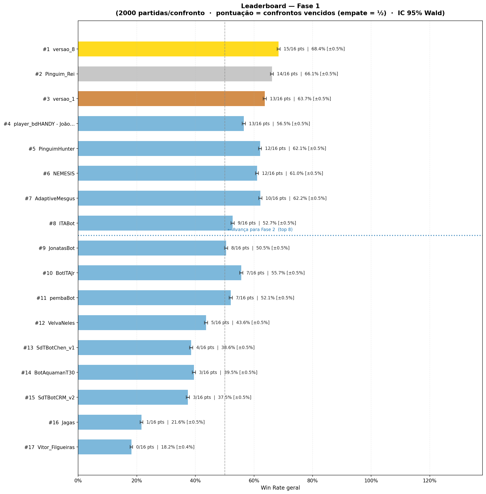

# Relatório — Fase 1 (Hackathon Yamada / ITA Jr.)

Torneio de poker heads-up entre os bots submetidos. Esta pasta reúne as
submissões da Fase 1 a que tive acesso e o relatório do que aconteceu.

## Formato do torneio

- **17 bots** em todos-contra-todos (round-robin).
- **2000 partidas por confronto** (cada par de bots se enfrenta 2000 vezes).
- **Pontuação = confrontos vencidos**, empate no confronto vale **½** ponto.
  Como há 16 oponentes, o máximo é **16/16 pts**.
- Intervalo de confiança **95% Wald**, margem ≈ ±0.5% (2000 partidas dão IC bem estreito).
- **Top 8 avançam para a Fase 2.** A linha de corte ficou entre o #8 (ITABot)
  e o #9 (JonatasBot).

> ⚠️ Detalhe importante do ranking: a classificação é por **confrontos vencidos**,
> não pela win rate geral. Por isso um bot consistente (ganha muitos confrontos,
> mesmo que apertado) fica acima de um bot que esmaga poucos e perde vários —
> ver o caso bdHANDY (#4) vs PinguimHunter (#5) abaixo.

## Imagens

## Leaderboard final

| #  | Bot                       | Pontos  | Win Rate geral | Observação |
|----|---------------------------|---------|----------------|------------|
| 1  | **versao_8** (Ivan)       | 15/16   | **68.4%**      | 🏆 Campeão |
| 2  | Pinguim_Rei (Luan Stohr)  | 14/16   | 66.1%          | 🥈 |
| 3  | **versao_1**              | 13/16   | 63.7%          | 🥉 |
| 4  | bdHANDY (João Carvalho)   | 13/16   | 56.5%          | |
| 5  | PinguimHunter             | 12/16   | 62.1%          | |
| 6  | NEMESIS (Arthur Cardozo)  | 12/16   | 61.0%          | |
| 7  | AdaptiveMesgus (G. Mesquita) | 10/16 | 62.2%        | |
| 8  | ITABot                    | 9/16    | 52.7%          | ← último a avançar (top 8) |
| –  | — — — corte Fase 2 — — —  |         |                | |
| 9  | JonatasBot                | 8/16    | 50.5%          | |
| 10 | BotITAJr                  | 7/16    | 55.7%          | |
| 11 | pembaBot                  | 7/16    | 52.1%          | |
| 12 | VelvaNeles                | 5/16    | 43.6%          | |
| 13 | SdTBotChen_v1             | 4/16    | 38.6%          | |
| 14 | BotAquamanT30             | 3/16    | 39.5%          | |
| 15 | SdTBotCRM_v2              | 3/16    | 37.5%          | |
| 16 | Jagas                     | 1/16    | 21.6%          | |
| 17 | Vitor_Filgueiras          | 0/16    | 18.2%          | não venceu nenhum confronto |

## Destaque: os bots da linhagem (versao_8 e versao_1)

Os dois bots da minha linhagem terminaram **#1 e #3**, ambos classificados para a
Fase 2 com folga.

### versao_8 — campeão (15/16 pts, 68.4% WR)

Venceu o torneio sendo o bot **mais consistente do campo**: ganhou ou empatou
**todos os confrontos menos um**. O único confronto perdido foi contra o
Pinguim_Rei (49% — praticamente um cara-ou-coroa). Win rate da **linha versao_8
contra cada coluna**:

| Oponente        | WR   | | Oponente        | WR   |
|-----------------|------|-|-----------------|------|
| Pinguim_Rei     | 49%  | | pembaBot        | 69%  |
| versao_1        | 58%  | | VelvaNeles      | 69%  |
| bdHANDY         | 54%  | | SdTBotChen_v1   | 87%  |
| PinguimHunter   | 54%  | | BotAquamanT30   | 78%  |
| NEMESIS         | 57%  | | SdTBotCRM_v2    | 88%  |
| AdaptiveMesgus  | 58%  | | Jagas           | 87%  |
| ITABot          | 72%  | | Vitor_Filgueiras| 90%  |
| JonatasBot      | 60%  | |                 |      |
| BotITAJr        | 63%  | |                 |      |

Leitura: nenhum matchup ruim (piso em 49%), domínio folgado sobre a metade
fraca do campo (78–90% vs os últimos colocados) e vantagem clara até contra os
adversários de topo (54–58% vs Pinguim_Rei/bdHANDY/PinguimHunter/AdaptiveMesgus).

### versao_1 — 3º lugar (13/16 pts, 63.7% WR)

Win rate da **linha versao_1 contra cada coluna**:

| Oponente        | WR   | | Oponente        | WR   |
|-----------------|------|-|-----------------|------|
| versao_8        | 42%  | | VelvaNeles      | 79%  |
| Pinguim_Rei     | 42%  | | SdTBotChen_v1   | 70%  |
| bdHANDY         | 55%  | | BotAquamanT30   | 68%  |
| PinguimHunter   | 55%  | | SdTBotCRM_v2    | 73%  |
| NEMESIS         | 47%  | | Jagas           | 88%  |
| AdaptiveMesgus  | 54%  | | Vitor_Filgueiras| 80%  |
| ITABot          | 67%  | |                 |      |
| JonatasBot      | 70%  | | pembaBot        | 68%  |
| BotITAJr        | 62%  | |                 |      |

Perdeu apenas 3 confrontos: versao_8 (42%), Pinguim_Rei (42%) e NEMESIS (47%) —
exatamente os bots do topo. Contra todo o resto do campo ficou positivo.

## O que aconteceu — análise

1. **Consistência ganhou da força bruta.** O critério "confrontos vencidos"
   premiou quem não tem matchup ruim. versao_8 só não venceu 1 dos 16 confrontos
   e ficou em 1º; já bots com WR geral parecida (AdaptiveMesgus 62.2%,
   PinguimHunter 62.1%) ficaram em 5º–7º porque perderam mais confrontos diretos.

2. **O paradoxo bdHANDY vs PinguimHunter.** bdHANDY (#4) tem WR geral **menor**
   (56.5%) que PinguimHunter (#5, 62.1%), mas ficou **à frente** porque venceu
   mais confrontos (13 vs 12 pts). Ou seja: ganhar "no detalhe" muitos duelos
   vale mais do que esmagar poucos — alinhado com a filosofia que guiou o
   versao_8 (maximizar nº de matchups ganhos, não a margem).

3. **Campo polarizado.** O topo (versao_8, Pinguim_Rei, versao_1) decidia entre
   si em margens curtas (49–58%), mas todos esmagavam a cauda (SdTBotChen_v1,
   BotAquamanT30, SdTBotCRM_v2, Jagas, Vitor_Filgueiras), que somaram 0–4 pts.
   Vitor_Filgueiras não venceu nenhum confronto (0/16, 18.2%).

4. **A rivalidade que definiu o 1º lugar.** Pinguim_Rei foi o único bot a vencer
   o versao_8 no confronto direto (51% na visão dele / 49% na nossa), mas perdeu
   um confronto a mais no resto da tabela e ficou em 2º. O título saiu por
   **1 ponto** de margem (15 vs 14).

5. **Linha de corte apertada.** ITABot (#8, 9 pts) avançou; JonatasBot (#9, 8 pts)
   ficou de fora por **1 ponto**. Curiosamente o #10 BotITAJr tinha WR geral maior
   (55.7%) que o #8 e o #9 — de novo o efeito "pontos por confronto vs WR geral".

## Arquivos nesta pasta

Submissões da Fase 1 disponíveis (o nome traz o autor):

| Arquivo | Posição na Fase 1 |
|---------|-------------------|
| `player_versao_8 - Ivan Yamasaki.py`              | #1 🏆 |
| `player_pinguim_rei - Luan Stohr.py`              | #2 |
| `player_bdHANDY - João Carvalho.py`               | #4 |
| `player_NEMESIS - Arthur Cardozo.py`              | #6 |
| `player_AdaptiveMesgus - Gustavo Mesquita França.py` | #7 |
| `player_pokerBot - Amad3u.py`                     | participante |
| `player_predator - Bernardo Papa Segura (BerPapaSeg).py` | participante |
| `player_RM_bot - Raimundo Costa.py`               | participante |

> Os bots do leaderboard que não estão aqui (PinguimHunter, ITABot, JonatasBot,
> BotITAJr, pembaBot, VelvaNeles, etc.) são submissões de outros participantes
> cujos arquivos não estão neste acervo local.
