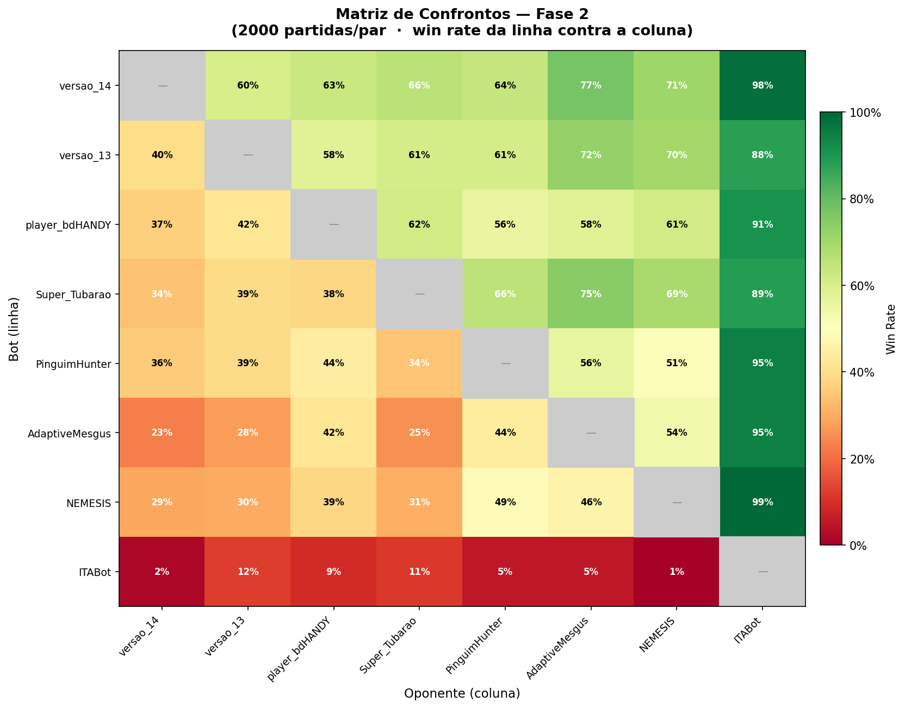
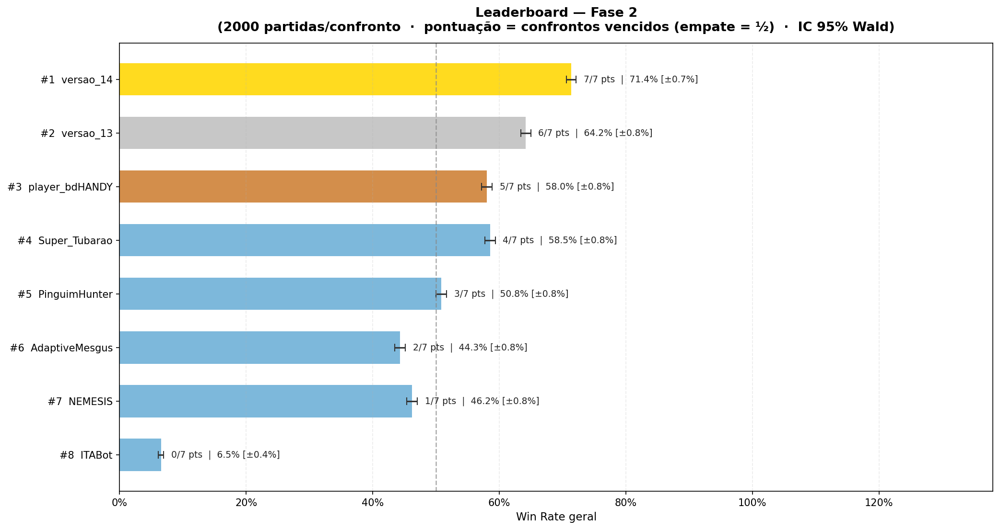

# Relatório — Fase 2 (Hackathon Yamada / ITA Jr.)

Torneio de poker heads-up entre os bots que avançaram da Fase 1. Esta pasta reúne
as submissões da Fase 2 e o relatório do que aconteceu.

## Formato do torneio

- **8 bots** em todos-contra-todos (round-robin) — os **Top 8** da Fase 1.
- **2000 partidas por confronto** (cada par de bots se enfrenta 2000 vezes).
- **Pontuação = confrontos vencidos**, empate no confronto vale **½** ponto.
  Como há 7 oponentes, o máximo é **7/7 pts**.
- Intervalo de confiança **95% Wald**, margem ≈ ±0.7–0.8% (2000 partidas dão IC bem estreito).

> ⚠️ Mesmo detalhe da Fase 1: a classificação é por **confrontos vencidos**, não
> pela win rate geral. Por isso um bot consistente fica acima de outro com WR
> geral maior — ver o caso bdHANDY (#3) vs Super_Tubarao (#4) e
> AdaptiveMesgus (#6) vs NEMESIS (#7) abaixo.

## Imagens

## Leaderboard final

| #  | Bot                          | Pontos | Win Rate geral | IC 95% | Observação |
|----|------------------------------|--------|----------------|--------|------------|
| 1  | **versao_14** (Ivan)         | 7/7    | **71.4%**      | ±0.7%  | 🏆 Campeão |
| 2  | **versao_13** (linhagem)     | 6/7    | 64.2%          | ±0.8%  | 🥈 |
| 3  | bdHANDY (João Carvalho)      | 5/7    | 58.0%          | ±0.8%  | 🥉 |
| 4  | Super_Tubarao (Luan Stohr)   | 4/7    | 58.5%          | ±0.8%  | WR > #3, mas menos confrontos |
| 5  | PinguimHunter                | 3/7    | 50.8%          | ±0.8%  | |
| 6  | AdaptiveMesgus (G. Mesquita) | 2/7    | 44.3%          | ±0.8%  | |
| 7  | NEMESIS (Arthur Cardozo)     | 1/7    | 46.2%          | ±0.8%  | WR > #6, mas menos confrontos |
| 8  | ITABot                       | 0/7    | 6.5%           | ±0.4%  | não venceu nenhum confronto |

## Destaque: os bots da linhagem (versao_14 e versao_13)

Os dois bots da minha linhagem terminaram **#1 e #2** — repetindo o pódio duplo
da Fase 1 (lá tinham sido versao_8 e versao_1), agora ocupando os **dois
primeiros lugares**. O confronto direto entre eles (versao_14 60.5% × versao_13)
foi o que definiu o título.

### versao_14 — campeão (7/7 pts, 71.4% WR)

Venceu o torneio com **placar perfeito**: ganhou **todos os 7 confrontos**.
Win rate da **linha versao_14 contra cada coluna**:

| Oponente        | WR    | | Oponente        | WR    |
|-----------------|-------|-|-----------------|-------|
| versao_13       | 60.5% | | AdaptiveMesgus  | 77.0% |
| Super_Tubarao   | 65.9% | | NEMESIS         | 70.8% |
| bdHANDY         | 63.0% | | ITABot          | 98.4% |
| PinguimHunter   | 64.0% | |                 |       |

Leitura: **nenhum matchup abaixo de 60%**. O piso (60.5%) foi justamente contra
o vice (versao_13), e mesmo assim com margem confortável; contra todo o resto do
campo ficou entre 63% e 98%. Foi o bot mais dominante das duas fases.

### versao_13 — vice-campeão (6/7 pts, 64.2% WR)

Win rate da **linha versao_13 contra cada coluna**:

| Oponente        | WR    | | Oponente        | WR    |
|-----------------|-------|-|-----------------|-------|
| versao_14       | 39.6% | | AdaptiveMesgus  | 72.4% |
| Super_Tubarao   | 60.7% | | NEMESIS         | 70.0% |
| bdHANDY         | 58.1% | | ITABot          | 87.6% |
| PinguimHunter   | 60.9% | |                 |       |

Perdeu **apenas 1 confronto**: o duelo direto contra o versao_14 (39.6%). Contra
todos os outros 6 oponentes ficou positivo (58–88%), o que garantiu o 2º lugar
com folga sobre o #3.

## O que aconteceu — análise

1. **Pódio duplo da linhagem, agora em 1º e 2º.** versao_14 e versao_13 não só
   avançaram como **monopolizaram o topo**. Juntos perderam **um único confronto
   entre os 13 que disputaram** (versao_13 vs versao_14). O resto do campo nunca
   chegou perto.

2. **Placar perfeito do campeão.** versao_14 fez **7/7** — ganhou todos os
   confrontos, algo que nem o versao_8 (campeão da Fase 1, 15/16) tinha
   conseguido. O salto de versão entre fases se traduziu em domínio total.

3. **O paradoxo "pontos vs WR geral" voltou — duas vezes.** Mesmo critério da
   Fase 1 produziu duas inversões no ranking:
   - **bdHANDY (#3, 5/7, 58.0%)** ficou **à frente** de **Super_Tubarao
     (#4, 4/7, 58.5%)**, apesar da WR geral menor — ganhou mais confrontos diretos.
   - **AdaptiveMesgus (#6, 2/7, 44.3%)** ficou **à frente** de **NEMESIS
     (#7, 1/7, 46.2%)** pelo mesmo motivo.

   Ou seja: vencer mais duelos vale mais do que ter WR média alta — exatamente a
   filosofia que guiou a linhagem.

4. **Campo mais forte, mas mais polarizado no topo.** Diferente da Fase 1, aqui
   só sobraram os 8 melhores, então a "cauda fraca" praticamente sumiu — exceto
   por um caso extremo: o **ITABot**.

5. **O colapso do ITABot.** Último a avançar na Fase 1 (#8), o ITABot **não
   venceu nenhum confronto** na Fase 2 (0/7, 6.5% WR geral), perdendo todos os
   matchups por margens enormes (1.6% vs versao_14, 0.6% vs NEMESIS, 5.2% vs
   PinguimHunter). Foi o "Vitor_Filgueiras" desta fase — o piso do campo.

6. **Meio de tabela embolado.** Entre bdHANDY (#3) e NEMESIS (#7) os WR gerais
   ficaram numa faixa estreita (44–58%), com vários confrontos quase no
   cara-ou-coroa (NEMESIS×PinguimHunter 48.9%, AdaptiveMesgus×NEMESIS 53.5%,
   PinguimHunter×bdHANDY 44.4%). A ordem final saiu mais pela contagem de
   confrontos do que por superioridade clara.

## Arquivos nesta pasta

Submissões da Fase 2 (o nome traz o autor):

| Arquivo | Posição na Fase 2 |
|---------|-------------------|
| `player_versao_14 - Ivan Yamasaki.py`              | #1 🏆 |
| `player_versao_13 (1) - Amad3u.py`                 | #2 🥈 (bot da linhagem) |
| `player_bdHANDY - João Carvalho.py`                | #3 🥉 |
| `player_super_tubarao - Luan Stohr.py`             | #4 |
| `player_AdaptiveMesgus - Gustavo Mesquita Franca.py` | #6 |
| `player_NEMESIS - Arthur Cardozo.py`               | #7 |
| `player_RM_bot - Raimundo Costa.py`                | participante |
| `player_predator - Bernardo Papa Segura (BerPapaSeg).py` | participante |

> PinguimHunter (#5) e ITABot (#8) aparecem no leaderboard mas são submissões de
> outros participantes cujos arquivos não estão neste acervo local. Os arquivos
> de resultados completos (console, leaderboard, matriz e log) estão na pasta
> `results/` do repositório, com o sufixo `_fase_2`.
