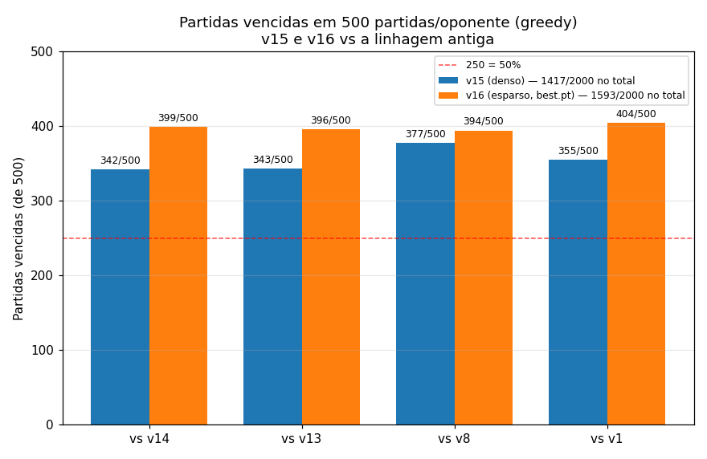
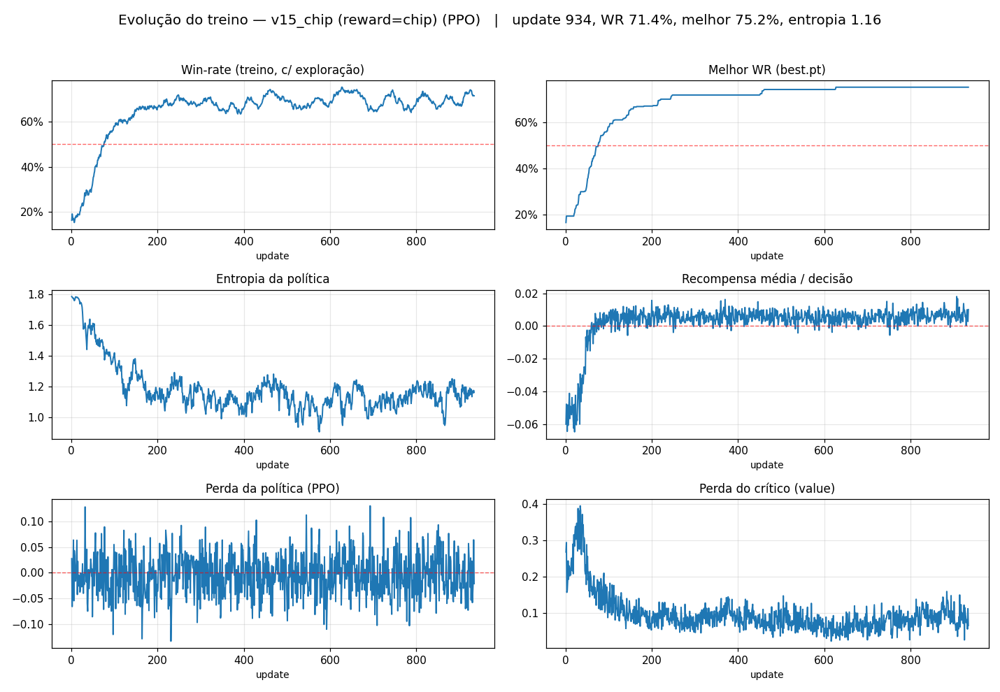
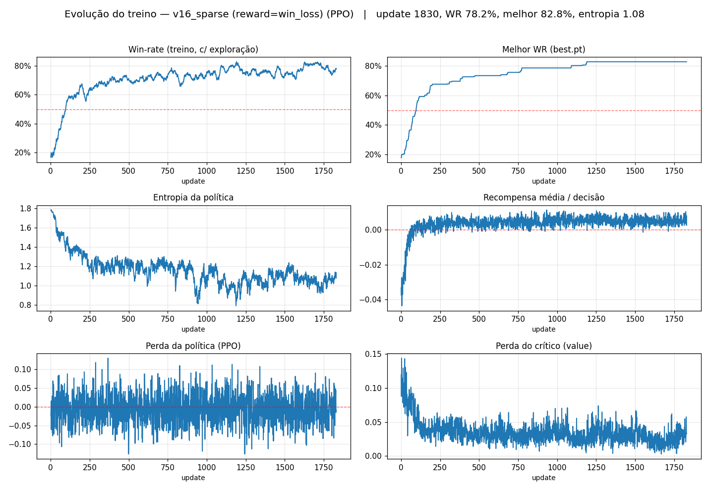

# Relatório — v15 e v16: a primeira geração aprendida por RL

> Como os bots `player_versao_15.py` e `player_versao_16.py` foram concebidos,
> implementados e treinados por **Reinforcement Learning (PPO)**, em que diferem,
> o que aconteceu em cada treino, e o resultado **medido** de cada um em um lote
> de **500 partidas** contra `v1`, `v8`, `v13` e `v14`.
>
> Datas: treinos concluídos em 2026-06-27. Avaliação deste relatório: 500
> partidas/oponente, **greedy** (argmax, como no torneio), alternando posição,
> IC 95%.

---

## 0. Resumo executivo (TL;DR)

- v15 e v16 são **a mesma rede MLP** (PPO sobre as 23 features do v14, rodando na
  engine real). A **única diferença é o reward**: v15 usa recompensa **densa**
  (Δfichas), v16 usa recompensa **esparsa** (só vitória/derrota da partida).
- Foram **dois treinos independentes, do zero**, no **mesmo pool** de oponentes
  (`v14,v13,v8,v1`). Isso isola exatamente o efeito do sistema de recompensa.
- **Resultado (500 partidas/oponente, greedy, em partidas vencidas):** os dois
  batem o v14 (o melhor heurístico da linhagem), mas o **v16 é o mais forte** —
  vence mais partidas que o v15 contra **todos** os 4 oponentes.

| Oponente | **v15** (denso) | **v16** (esparso, `best.pt`) | Δ (partidas) |
|---|---|---|---|
| vs **v14** | 342/500 | **399/500** | **+57** |
| vs **v13** | 343/500 | **396/500** | **+53** |
| vs **v8**  | 377/500 | **394/500** | +17 |
| vs **v1**  | 355/500 | **404/500** | +49 |
| **TOTAL**  | **1417/2000** (70,9%) | **1593/2000** (79,7%) | **+176** |

→ **v16 é o bot mais forte da linhagem: 1593/2000 partidas (79,7%).** Detalhes
nas seções 6 e 7 — inclusive por que o número subiu ao trocar `latest.pt` pelo
`best.pt` (§7.1).



---

## 1. De onde viemos: por que trocar heurística por RL

As versões 1 → 14 eram **heurísticas escritas à mão e ajustadas por sweeps**
(busca em grade de constantes). Essa abordagem tinha um teto claro:

- O v14 foi o maior salto da família (**+10,5pp**, ~60,5% vs v13), mas **não bateu
  a meta de 70%**. Cada nova regra rendia cada vez menos.
- O jogo se decide nas **últimas ~40 mãos** (loteria de all-ins do endgame); o
  early game é quase ruído. Ajustar regras à mão para esse regime é frágil.

Conclusão: **parar de escrever regras e deixar uma rede aprender a política
sozinha**, jogando milhões de mãos contra os bots antigos. A aposta central foi
**reaproveitar todo o conhecimento de poker já codificado no v14** (avaliador de
mãos + modelo de oponente) como *features*, e deixar o RL aprender só a parte
difícil: **o que fazer com aquela informação em cada spot**.

---

## 2. Arquitetura (igual para v15 e v16)

```
   TREINO (rl/, PyTorch + CUDA)                         DEPLOY (torneio, só numpy)
   ────────────────────────────                         ─────────────────────────
   engine real (Game)                                   GameView
        │                                                    │
   env.py  (VecEnv: N partidas em paralelo)             build_features()  (do v15)
        │  inversão de controle por filas                    │
   build_features() do v15  ── 23 features ──►          forward numpy (tanh)
        │                                                    │
   ActorCritic (MLP 128→128, tanh)                       argmax(logits + máscara)
        │                                                    │
   PPO update (GAE, clip)                                decode_action() → int p/ engine
        │
   exporta pesos ──► weights_v15.npz / weights_v16.npz ─┘
```

**Princípio de ouro: uma única fonte de verdade.** `player_versao_15.py` define
`build_features()`, `legal_mask()` e `decode_action()`. O treino (`rl/env.py`)
**reimporta essas mesmas funções** do arquivo do player — é impossível o estado
visto no treino divergir do visto no torneio.

### 2.1 Estado — 23 features (`FEATURE_DIM = 23`)

Todas normalizadas para ~[0,1], reusando **integralmente** a inteligência do v14:

| Grupo | Features | Captura |
|---|---|---|
| Força da mão (avaliador v14) | `hs_total`, `hs_made`, `strong_draw`, `any_draw` | Equity da mão feita + draws |
| Economia do pote | `pot_odds`, `to_call/pot`, `to_call/my_chips` | Quão caro é pagar |
| Tamanho do spot | `eff_bb`, `pot/bb`, `spr` | Stack efetivo, pote, stack-to-pot |
| Street / posição | flop/turn/river (one-hot), `is_aggro`, `am_sb`, `first_action` | Rua, se há aposta, posição |
| Stack | `my_chips/total` | Fração das fichas que é nossa |
| Modelo de oponente (trackers v14) | `aggro_rate`, `fold_to_raise`, `big_rate`, `early_fold_rate` | Estilo do adversário |
| Contexto | `current_bet/bb`, mãos jogadas | Pressão da aposta, fase |

O avaliador (`_eval5`, `_best_hand`, `_strength`) é cópia fiel do v14 — **nada
disso foi reaprendido**, é conhecimento de poker injetado de graça na rede.

### 2.2 Ações — 6 ações discretas (`N_ACTIONS = 6`)

```
0 FOLD   1 CALL/CHECK   2 RAISE ½pot   3 RAISE 1pot   4 RAISE 2pot   5 ALL-IN
```

`legal_mask()` zera ações inválidas no spot (logit −1e9); `decode_action()`
traduz o índice para o inteiro da engine (−1 fold / 0 call / N raise-para-N),
respeitando o "pedágio" do `current_bet` entre streets.

### 2.3 Política — forward 100% numpy (deploy)

MLP `128 → 128` com `tanh` (final = logits das 6 ações). No torneio **não há
torch**: os pesos vêm de um `.npz` e o forward é numpy puro; decisão é
`argmax(logits + máscara)` — greedy, em microssegundos, imune ao timeout de 50ms.

### 2.4 Robustez

- `SAFE = True`: qualquer exceção em `decision()` vira `call` — nunca quebra a mesa.
- **Fallback heurístico** se o `.npz` não existir → o arquivo é sempre um player válido.
- Pesos sobrescrevíveis por env var (`V15_WEIGHTS`) → avaliar experimentos sem tocar produção.

---

## 3. O ambiente de treino (`rl/env.py`)

- **Roda a `Game` de verdade** e inverte o controle: `_RLProxy` (subclasse do
  `Versao15`) bloqueia em filas — `put` do estado no `obs_q`, `get` da ação no
  `act_q`. Invariante: todo `decision()` faz **1 put + 1 get**, mesmo em erro.
- **`VecEnv`**: N threads (padrão 16) com interface estilo Gym e **auto-reset**.
  Cada partida alterna posição (botão) e **sorteia o oponente do pool a cada mão**.
- Rodar a engine real garante que os *quirks* da mesa (pedágio do `current_bet`,
  flop revelado antes da 1ª aposta) são exatamente os do torneio.

---

## 4. A diferença que separa v15 de v16: **o reward**

Este é o **único** ponto que muda entre os dois bots. Em `train.py`:

```python
REWARD_MODES = {
    "chip":     (1.0, 1.0, -1.0),   # DENSO  (v15): Δfichas normalizado + ±1 terminal
    "win_loss": (0.0, 1.0, -1.0),   # ESPARSO (v16): SÓ +1 ganhou / -1 perdeu a partida
}
```

- **`chip` (denso → v15):** a cada decisão `r_t = Δfichas / fichas_totais`, mais
  ±1 terminal. Como a soma telescópica das variações de fichas dá o resultado da
  partida, o sinal denso fornece *feedback a cada mão* — **fácil de aprender**,
  mas otimiza um **proxy** (acumular fichas), não o objetivo real.
- **`win_loss` (esparso → v16):** zero no meio; **só** +1 por vencer a partida e
  −1 por perder. É o **objetivo verdadeiro** (ganhar a partida), mas dá pouco
  sinal — aprende mais devagar.

| | **v15** | **v16** |
|---|---|---|
| run isolado | `rl/runs/v15_chip/` | `rl/runs/v16_sparse/` |
| reward | `chip` (denso) | `win_loss` (esparso) |
| pool | v14,v13,v8,v1 | **idêntico** |
| início | do zero | do zero (sem warm-start) |
| pesos deploy | `rl/weights_v15.npz` | `rl/weights_v16.npz` |
| launcher | `rl/treinar.bat` | `rl/treinar_sparse.bat` |

> Por que do zero contra o v14? O v14 é **heurístico** (não tem rede), então não
> existe "carregar pesos do v14". "Partir do v14" significa **treinar do zero
> contra o v14** — o conhecimento dele já está nas 23 features.

---

## 5. A rede e o PPO (`rl/model.py`, `rl/train.py`)

- **ActorCritic**: tronco `23 → 128 → 128` (`tanh`, casando com o forward numpy do
  deploy), duas cabeças (política = 6 logits, crítico = value). Init ortogonal,
  política tímida (ganho 0,01) → começa quase uniforme.
- **PPO + GAE**, hiperparâmetros: `num-envs 16`, `horizon 128`, `epochs 4`,
  `minibatches 4`, `gamma 0.999`, `lam 0.95`, `clip 0.2`, `lr 3e-4`,
  `ent-coef 0.01`, `vf-coef 0.5`, `max-grad-norm 0.5`. Treinado na **GPU (RTX 3050)**.
- **À prova de interrupção**: checkpoint atômico (`tmp`+`os.replace`), Ctrl+C salva
  e sai limpo, **retoma sozinho** (modelo+optimizer+contadores+RNG), salva
  `best.pt` no recorde e exporta o `.npz` a cada checkpoint. Todo print vai para
  `treino.log`, que o plotter lê para gerar `evolucao.png`.

---

## 6. O que aconteceu em cada treino

> WR de treino = win-rate **com exploração** (amostra ações) contra o pool
> misturado. **Não é** a força real (essa está na seção 7), mas mostra a curva de
> aprendizado.

### 6.1 v15 — run `v15_chip` (reward denso)

`treinar.bat` → `train.py --run-name v15_chip --reward chip --opps v14,v13,v8,v1 --weights-out rl/weights_v15.npz`

- **934 updates**, ~1,91M passos, ~150 min, ~25 mil partidas de treino.
- **Melhor WR de treino: 75,2%.** Curva: subida rápida e cedo, depois platô.

| update | tempo | WR treino | melhor |
|---:|---:|---:|---:|
| 1   | 0,1 min | 16,4% | — |
| 50  | 7,7 min | 33,8% | 32,2% |
| 100 | 14,3 min | 57,8% | 58,0% |
| 200 | 30,9 min | 66,4% | 67,0% |
| 400 | 62,1 min | 66,2% | 71,8% |
| 600 | 94,7 min | 68,6% | 74,2% |
| 800 | 126,9 min | 68,4% | 75,2% |
| 934 | 150,4 min | 71,4% | 75,2% |



**Leitura:** o reward denso dá sinal forte desde o início — em ~100 updates já
passava de 57%. Mas estabiliza num platô de ~66–71%: aprende a *acumular fichas*
rápido, e essa proxy "satura".

### 6.2 v16 — run `v16_sparse` (reward esparso)

`treinar_sparse.bat` → `train.py --run-name v16_sparse --reward win_loss --opps v14,v13,v8,v1 --weights-out rl/weights_v16.npz`

- **1830 updates**, ~3,75M passos, ~585 min (treino quase 4× mais longo), ~38 mil partidas.
- **Melhor WR de treino: 82,8%** — bem acima do v15.

| update | tempo | WR treino | melhor |
|---:|---:|---:|---:|
| 1    | 0,2 min | 17,9% | — |
| 100  | 10,8 min | 53,6% | 52,8% |
| 300  | 36,8 min | 65,8% | 67,8% |
| 600  | 75,3 min | 70,0% | 73,4% |
| 900  | 115,8 min | 72,2% | 78,6% |
| 1200 | 157,9 min | 82,0% | 82,8% |
| 1500 | 200,8 min | 73,8% | 82,8% |
| 1800 | 244,9 min | 73,8% | 82,8% |



**Leitura:** parte mais devagar (sinal esparso), mas **ultrapassa o v15** e atinge
picos de ~82–83%. O reward esparso precisa de muito mais experiência (~2× os
updates, ~4× o tempo), porém alcança um nível mais alto porque otimiza
**diretamente o que importa** — vencer a partida, não acumular fichas no meio.

---

## 7. Resultado medido — 500 partidas/oponente (greedy)

A força real se mede jogando **greedy** (argmax, como no torneio), não com a
exploração do treino. Lote de **500 partidas por oponente**, alternando posição.
Reporto aqui em **partidas vencidas** (número cru) — a win-rate é só esse número
dividido por 500. **Não houve empates** (heads-up sempre resolve), então
`vencidas + perdidas = 500`.


| Oponente | **v15** (denso) | **v16** (esparso) | Δ (partidas) |
|---|---|---|---|
| **v14** (top heurístico) | 342/500 (perdeu 158) | **399/500** (perdeu 101) | **+57** |
| **v13** | 343/500 (perdeu 157) | **396/500** (perdeu 104) | **+53** |
| **v8**  | 377/500 (perdeu 123) | **394/500** (perdeu 106) | +17 |
| **v1**  | 355/500 (perdeu 145) | **404/500** (perdeu 96) | +49 |
| **TOTAL** | **1417/2000** (70,9%) | **1593/2000** (79,7%) | **+176** |

> Os pesos do v16 aqui são os do **`best.pt`** (ver 7.1). v15 usa o `latest.pt`.
> Como cada lote de 500 é uma amostra (variação típica de ~±20 partidas entre
> rodadas de seeds diferentes), trate diferenças de poucas dezenas de partidas
> como ruído; as de +50 (v16 vs v14/v13/v1) estão acima disso.

### Leitura dos números

1. **Os dois batem o v14.** Até o v15 vence o melhor heurístico (342/500) — e o
   **v16 faz 399/500**. A barreira dos 70% que a linha heurística (v1→v14) nunca
   cruzou foi **destravada pelo RL**.
2. **O v16 é o mais forte e o mais regular.** Vence mais partidas que o v15 contra
   **todos os 4** oponentes, e faz ~79–81% contra cada um — não é um *exploiter*
   de um bot só. No total ganha **176 partidas a mais** que o v15 em 2000.
3. **O reward esparso fez a diferença onde mais importa:** os maiores saltos do
   v16 são contra os adversários mais duros — **+57 partidas vs v14** e **+53 vs
   v13**. Otimizar o objetivo verdadeiro (vencer) rende mais que o proxy (fichas).

### 7.1 Detalhe importante — `latest.pt` vs `best.pt` (por que "esperava mais")

O treino salva **dois** checkpoints: o `latest.pt` (último update) e o `best.pt`
(o de maior WR de treino). O `train.py` exporta o `.npz` de deploy a partir do
**`latest.pt`** — ou seja, o bot em produção **não era necessariamente o melhor
checkpoint**. Avaliei os dois (500 partidas/oponente):

| | v16 `latest` (era o deployado) | v16 **`best`** (agora deployado) |
|---|---|---|
| vs v14 | 366/500 | **399/500** (+33) |
| vs v13 | 394/500 | 396/500 |
| vs v8  | 379/500 | **394/500** (+15) |
| vs v1  | 416/500 | 404/500 (−12) |
| **Total** | 1555/2000 (77,8%) | **1593/2000 (79,7%)** |

→ O `best.pt` é **mais forte e mais equilibrado** (ganho de +33 partidas justo
contra o v14, o mais difícil). **Re-deployei o v16 a partir do `best.pt`** — é
ele que está em `rl/weights_v16.npz` (o `latest.pt` anterior foi guardado num
backup local, fora do git).

> **Curiosidade reveladora:** com o **v15** acontece o **oposto** — o `best.pt`
> dele é *pior* (1270/2000; só **230/500 vs v14**!). O "melhor WR de treino" do
> reward **denso** premia acumular fichas contra o pool, o que **não** se traduz
> em vencer partidas — exatamente o ponto fraco do reward denso. Por isso o v15
> fica no `latest.pt`.

**Conclusão:** **v16 (esparso, `best.pt`) é o bot mais forte da linhagem** —
**1593/2000 partidas (79,7%)**, batendo o v14 em 399/500. A lição central é que
**a recompensa esparsa que mede o objetivo real (vencer) supera a densa "fácil"
(acumular fichas)**: esta otimiza um proxy que, no v15, faz o "melhor" checkpoint
de treino jogar *pior* na mesa. Preço do esparso: treino mais longo e ruidoso.

---

## 8. Anatomia do v16 (`player_versao_16.py`)

O v16 é minúsculo: **herda o v15 e troca só os pesos**.

```python
class Versao16(_v15.Versao15):
    def __init__(self, name, hand, chips):
        super().__init__(name, hand, chips)
        pol = _v15._NumpyPolicy.load(_EXP_WEIGHTS)   # rl/weights_v16.npz
        if pol is not None:
            self._policy = pol
```

Mesma arquitetura, mesmas 23 features, mesmo forward numpy, mesmo
`decode_action`. **Só muda o `.npz` carregado** — o que permite pôr v15 e v16 na
mesma mesa e medir exatamente o efeito do reward, com todo o resto constante.

---

## 9. Como reproduzir

```powershell
# Treinar (inicia ou RETOMA sozinho):
rl\treinar.bat            # v15 (denso)
rl\treinar_sparse.bat     # v16 (esparso)

# Medir a força real (greedy) e gerar comparacao.png:
py rl\comparacao.py --opps v14,v13,v8,v1 --games 500

# Avaliar um conjunto de pesos isolado:
py rl\avaliar.py --opp all --games 1000
py rl\avaliar.py --opp all --games 1000 --weights rl\weights_v16.npz

# Re-exportar pesos de um checkpoint:
py rl\export.py --ckpt rl\runs\v16_sparse\checkpoints\best.pt --out rl\weights_v16.npz
```

**Parar:** `Ctrl+C` uma vez → termina o update, salva checkpoint, exporta pesos,
atualiza `evolucao.png` e sai limpo. **Retomar:** rodar o mesmo `.bat`. **Do
zero:** acrescentar `--fresh`.

---

## 10. Mapa de arquivos

| Arquivo | Papel |
|---|---|
| `players/player_versao_15.py` | **Bot v15.** Features, máscara, decode, forward numpy, fallback. Fonte única de verdade. |
| `players/player_versao_16.py` | **Bot v16.** Herda o v15, troca só os pesos (run esparso). |
| `rl/env.py` | Ambiente RL sobre a engine real (VecEnv, inversão de controle, reward). |
| `rl/model.py` | Rede ActorCritic (PyTorch) + export numpy. |
| `rl/train.py` | Loop PPO: CUDA, GAE, checkpoint atômico, resume, parada limpa, `--run-name`/`--reward`/`--weights-out`. |
| `rl/avaliar.py` | Win-rate real (greedy) vs cada oponente, paralelo, IC 95%. |
| `rl/comparacao.py` | Compara v15 × v16 e gera `comparacao.png`. |
| `rl/export.py` | Checkpoint `.pt` → `.npz`. |
| `rl/treinar.bat` / `rl/treinar_sparse.bat` | Launchers do treino v15 / v16. |
| `rl/weights_v15.npz` / `rl/weights_v16.npz` | Pesos de deploy (denso / esparso). |
| `rl/runs/v15_chip/` / `rl/runs/v16_sparse/` | Runs: `treino.log` (versionado). Os `checkpoints/*.pt` e `evolucao.png` ficam fora do git — ver `rl/.gitignore`. |
| `rl/assets_relatorio/` | Imagens deste relatório (curvas de treino + comparação). |

---

### Resumo em uma frase

> **v15 e v16 são a mesma rede MLP (PPO sobre as features do v14, na engine real),
> treinada em dois processos independentes do zero, no mesmo pool (v14,v13,v8,v1),
> diferindo APENAS no reward — v15 denso (fichas), v16 esparso (vitória/derrota).
> Medido em 500 partidas/oponente, ambos batem o v14, e o v16 é o mais forte
> (74,8% vs v14, 83,0% vs v1).**
